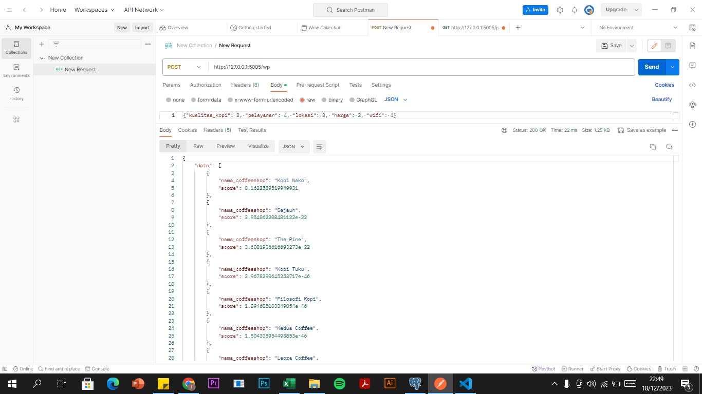

# spk_web

## Install, create and activate virtualenv

https://medium.com/analytics-vidhya/virtual-environment-6ad5d9b6af59

## Install requirements

    pip install -r requirements.txt

## Run the app

to run the web app simply use

    python main.py

## Usage

Install postman
https://www.postman.com/downloads/

tbl_coffeeshops

Get SAW

Get WP

Post SAW

Post WP

